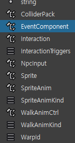
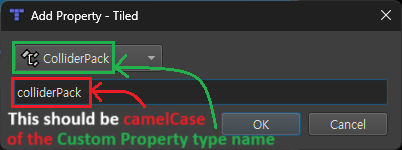
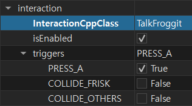

# GBATale

Unofficial Undertale port for the Game Boy Advance.


## Build

0. [Setup all the dependencies of Butano engine](https://gvaliente.github.io/butano/getting_started.html).
1. Clone this repo recursively, install Python3 requirements, and try to build it first.
    ```bash
    git submodule update --init
    pip install -r requirements.txt

    make -j{num_of_cpu_cores}
    ```
2. It'll fail to build first, and create `user_deps.json` on the root.\
   Download the dependencies manually, and specify the path to them on the `user_deps.json`.
   * "UndertaleDataWinPath"
      * Extract `data.win` from your copy of Undertale, specify the path to it.
   * "[UndertaleModCli](https://github.com/UnderminersTeam/UndertaleModTool/releases/tag/bleeding-edge)Path"
      * Download the version starts with `CLI-*`, specify the path to the executable.
3. You should now be able to build GBATale with `make -j{num_of_cpu_cores}`.


## Editing tilemaps

### Setup

0. Install [Tiled map editor](https://www.mapeditor.org/).
1. Open the [`extra/tilemaps/GBATale.tiled-project`](extra/tilemaps/GBATale.tiled-project) via `File > Open File or Project...`
   * This step is **required** to properly load the *Custom Properties* of the entities in `Entity` layer.
1. (Optional) Load the worlds `extra/tilemaps/*/*.world` via `World > Load World...`
1. Open the tilemap you want to edit: `extra/tilemaps/*/room_*.tmx`


### Attaching Custom Properties to entities

1. Right click the `Custom Properties` on the entity properties menu, and click `Add Property`
   * If you've loaded the `GBATale.tiled-project` properly, yon can select the custom property defined by GBATale:
      
1. When adding the property, make sure the property name is the *camelCase* of its type name:
   


#### Adding scripts to the `interaction` & `eventComponent` property

Forgive me, adding scripts for these is somewhat complex.\
I should have automated this process with a python script, but I haven't.


##### `interaction`

First, `interaction` requires `colliderPack` property to function correctly, you should add it.

Custom property `interaction` has a string member called `InteractionCppClass`:



You should define the same-named class in the [`include/game/cpnt/inter`](include/game/cpnt/inter/) and [`src/game/cpnt/inter`](src/game/cpnt/inter), inheriting from [`Interaction`](include/game/cpnt/inter/Interaction.hpp).\
See [`TalkFroggit.hpp`](include/game/cpnt/inter/TalkFroggit.hpp) & [`TalkFroggit.cpp`](src/game/cpnt/inter/TalkFroggit.cpp) for example.

Also, you need to add the same-named enum value in the [`InteractionType` enum](include/game/cpnt/inter/InteractionType.hpp).

And, you need to add this enum entry to the [`EntityInfo::create()` interaction switch-case](https://github.com/MrN830/GBATale/blob/462b08d2f37fe032037b408f4efda87635406338/src/game/ent/EntityInfo.cpp#L86) like this:
```cpp
case InteractionType::TalkFroggit:
   inter = &entMngr._cpntHeap.create<TalkFroggit>(entity, interaction->isEnabled, interaction->triggers);
   break;
```


##### `eventComponent`

It's very similar to `interaction`, so I'll briefly summarize.

* `eventComponent` doesn't need `colliderPack`, unlike `interaction`.
* `eventComponent` has a string member called `EventComponentCppClass`.
* Add the same-named class in the [`include/game/cpnt/ev`](include/game/cpnt/ev) and [`src/game/cpnt/ev`](src/game/cpnt/ev), inheriting from [`EventComponent`](include/game/cpnt/ev/EventComponent.hpp).
* Add the same-named enum value in the [`EventComponentType` enum](include/game/cpnt/ev/EventComponentType.hpp).
* Add this enum entry to the [`EntityInfo::create()` eventComponent switch-case](https://github.com/MrN830/GBATale/blob/462b08d2f37fe032037b408f4efda87635406338/src/game/ent/EntityInfo.cpp#L201).


## Setup dev environment

Install [VSCode](https://code.visualstudio.com/) and [Native Debug](https://marketplace.visualstudio.com/items?itemName=webfreak.debug) extension.


### Find include paths with C/C++ extension (IntelliSense)

[See this gist.](https://gist.github.com/copyrat90/eee49d92846ca3585a69d5bea001710d)


### Setup mGBA debugging

[See this guide.](https://felixjones.co.uk/mgba_gdb/vscode.html)


## Third-party licenses

See [butano/licenses/](butano/licenses/) and [licenses/](licenses/) for third-party licenses.
